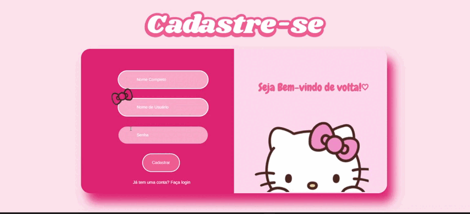

# 🐱 KittyWeb - Chat em Tempo Real


Um aplicativo web de chat em tempo real com autenticação de usuários, desenvolvido com Flask, SQLite e Socket.IO. A ideia do **KittyWeb** é proporcionar uma experiência simples, rápida e direta de conversa via navegador, com foco em agilidade e praticidade.

---

## 📽 Demonstração
<p align="center">
  
</p>


<p align="center">
  <video src="video/kittyweb.mp4" autoplay muted playsinline width="100%">
    Seu navegador não suporta a tag de vídeo HTML5.
  </video>
</p>


---

## 🔗 Link da Aplicação

Acesse o site online agora mesmo:

👉 [https://projeto-chat-kittyweb.onrender.com](https://projeto-chat-kittyweb.onrender.com)

---

## 📌 Descrição

O **KittyWeb** é um projeto de chat moderno, onde os usuários podem:

- Criar uma conta
- Fazer login com segurança
- Acessar uma sala de chat em tempo real
- Conversar com outros usuários conectados

A aplicação foi pensada para ser leve, rápida e funcional em navegadores desktop e mobile.

---

## ⚙️ Tecnologias Utilizadas

- **Python 3.13** – Lógica principal da aplicação
- **Flask** – Framework web backend
- **Socket.IO** – Comunicação em tempo real via WebSocket
- **SQLite** – Banco de dados leve e embutido
- **HTML5 & CSS3** – Estrutura e estilo das páginas
- **JavaScript** – Funcionalidades dinâmicas e interações no frontend
- **Render** – Hospedagem da aplicação

---

## 📁 Estrutura básica do projeto

```bash
KittyWeb/
├── app.py
├── templates/
│   ├── login.html
│   ├── cadastro.html
│   └── chat.html
├── static/
│   ├── css/
│   └── js/
├── database/
│   └── kittyweb.db
└── requirements.txt
